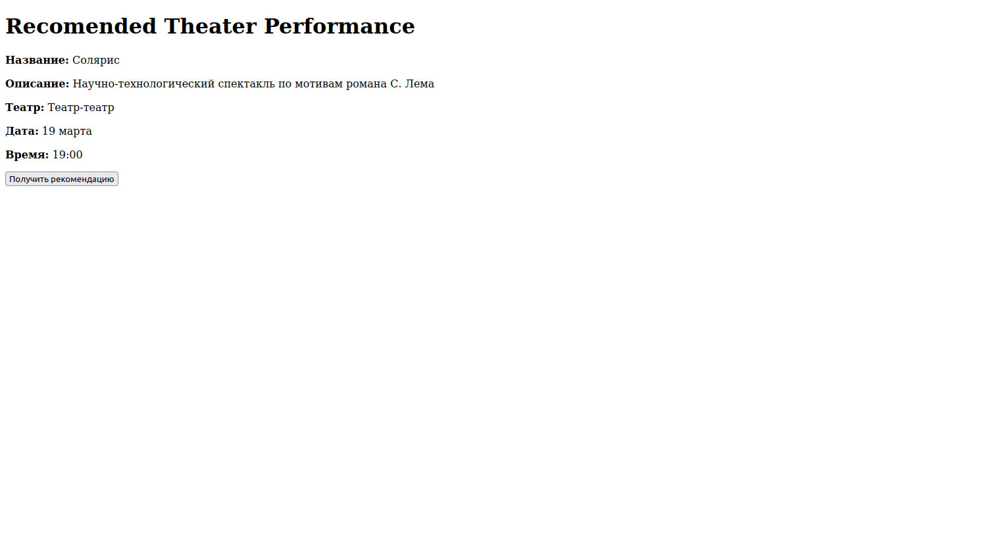

# Theater Guide

# Запуск
Чтобы запустить проект необходимо:
1. клонировать репозиторий к себе на устройство
2. перейти в директорию проекта
3. запустить скрипт build.sh
```
./build.sh
```
# Что оно делает

С помощью этого приложения вы можете получить данные о рекомендованном к посещению концерте в одном из двух популярных театров перми, Театр-театр и ТЮЗ.
Для получения свежей рекомендации необходимо нажать соответствующую кнопку.

кнопка имеет надпись получить рекомендацию




# На чем работает

В проекте я использовал фреймворк FastApi, SQLalchemy, SQLite, Jinja2, BeautifulSoup4, Requests, Schedule, Docker.

# Как Работает

Каждые 10 минут происходит обновление информации о концертах в базе данных. И на get запрос пользователя из близжайших концертов (3 месяца) выдается рекомендация по концерту.
